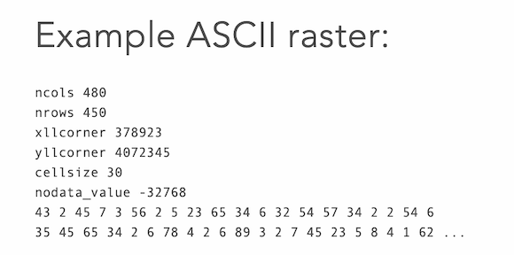

## Lab 2

### QGIS 

* Load a raster into QGIS and render with hillshading. Check out the various icons.

* Render  with singleband pseudocolor

* Render with contours.

* Ask QGIS to compute the contour lines: Use the Raster->ExtractContours and vizualize the contours overlayed on top of the hillshade.
  Experiment with the interval between contours.

### GDAL 

[GDAL](https://gdal.org/index.html) is an open source library for raster and vector geospatial data formats and comes with  a variety of useful command line utilities for data translation and processing. 
Try to download it. It will be useful to have it.  It can read a large number of raster formats (a list [here](https://gdal.org/drivers/raster/index.html)) and comes with a bunch of useful [raster utilities](https://gdal.org/programs/index.html#raster-programs). 

Once you install GDAL you will be able to run in the terminal any of these commands, for e.g you could run _gdalinfo_ on the dataset you downloaded to check its number of rows and columns, projection, and other info. 

While you are at it, run _gdal_translate_ to convert your dataset into an Arc Ascii file. 

### Creating a BMP file

To visualize the datasets we'll create in this class we will use the [BMP](https://en.wikipedia.org/wiki/BMP_file_format) file format for storing bitmap images. In a nutshell a BMP file has a header, a DIB (define independent bitmap header) and the  pixel array -- here is a [more detailed description](https://engineering.purdue.edu/ece264/17au/hw/HW15). The  details are a little hairy, so we will use an open source code to do this for us. 

Write code to create a bitmap that stores random colors. 

### Working with rasters in Arc Ascii format 

One of the raster formats is the so-called [Arc Ascii](https://desktop.arcgis.com/en/arcmap/latest/manage-data/raster-and-images/esri-ascii-raster-format.htm) format. An ArcAScii raster is an ascii file (ie text, not binary) that has the header at the top of the file, followed by the data values.  

Write code to read a raster from file. Define  an appropriate structure for a grid that contains all other information (rows, columns, xllcorner, etc).  Include a function to read a grid  from file . 

_Grid* grid_from_file(FILE* infile)_

Add helper functions to read the header, allocate the grid, read the data, print the header.  Write a main() function to test it. 

### Putting it all together using a Makefile 

Now put the files to work with bitmaps and the grid.{h,c} files in the same folder. We'll want to add a file to store the main() function, let's call it _main.c_ (Delete the main()functions from the other files because it won't compile with multiple main() functions). We'll want to  and add a Makefile. 

The main() functions should read in the grid specified on the command line (argv[1]), and create a bitmap file  of the same size, where each pixel n the image  has a color that is computed based on the height of that point in the grid. We'll want to linearly interpolate from the color based on teh elevation. 

At the end we'll get something that looks like this: 

### NEXT : TO think about 

* Add more colors so that it looks like a real map. You can divide the height range in a number of intervals.  For e.g.  5 intervals, blue for elev 0-10ft, gray 10-50ft, green 50ft-500ft, brown 500-1000, and dark brown 1000-hmax. 
  *  discrete color map: all points in a height interval with same color
  *  cotinuous:  the color of a point interpolated base don the height so that it matches the colors of the intervals.
 
* For the first project you'll work on extending what you've done so far to add hillshading. Check out hillshading, how it works and think how you might go about implementing it. 
