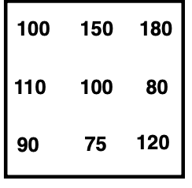

# --Lab 4: Aspect, slope and hillshading 

__Problem 1:__ Compute the hillshade value for the center cell with the following 3x3 elevation window: 

__Problem 2:__ Write code to compute the aspect, slope and hillshading for an elevation grid, and render them as bitmap files. 
