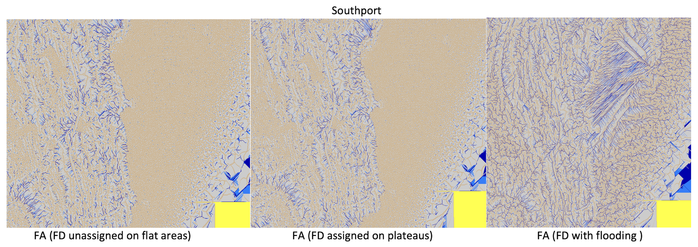
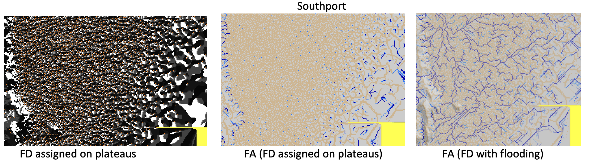

## Project 3:  Computing Flow on Terrains  


*** 
* __Assigned:__ Thursday, October 12
* __Due:__ Thursday October 26th 
* Group policy: Partner-optional

***

The goal of this project is flow on terrains. You will create a
program to compute and visualize the flow network derived from flow
direction and flow accumulation and write a report to showcase your
work.


__Input__: an elevation grid

__Output:__ a flow direction grid, a flow accumulation grid  and a number of bitmaps. 


Your code will read on the command line the name of an elevation grid,
and also the name of the flow direction grid and flow accumulation
grid which are to be created. For example, running with

```
./flow -e ~/DEMs/set1.asc -d fd.asc -a fa.asc
```

or
```
./flow ~/DEMs/set1.asc fd.asc fa.asc
```

will read _~/DEMs/set1.as_ as the elevation grid and will create a flow direction and
flow accumulation grid in the current directory called _fd.asc_ and
_fa.asc_ respectively (all grids in arcascii format).  

You will create the following bitmaps:

* elevation overlayed on hillshade
* flow direction (without handling flat areas), grayscale 
* flow accumulation (without flat areas), color intervals
* flow direction (with plateaus but no flooding), grayscale
* flow accumulation (with plateaus but no flooding), color interval
* same as above, overlayed on hillshade
* flow accumulation (with flooding and plateaus), color interval
* same as above, overlayed on hillshade


### Datasets


You can use the same dataset as in the previous project. The
flow network will look better on a mountainous terrain, but the effects of handling plateaus and flooding wil be larger on flat terrains.

_Test datasets:_ You can download the datasets used to generate the
maps on this page [here](https://tildesites.bowdoin.edu/~ltoma/teaching/DEM/). 


### Overview


You will start by reading the elevation grid and printing basic information about it (_grid.c_ has a function to do this). While you
are at it,  create a hillshade grid, a pixel_buffer, and use them to create a bitmap of the elevation overlayed on the hillshade.

Then you'll want to create the flow direction and flow accumulation grids. The module _grid.c_ has a function to create/initialize a grid based on on another grid, for e.g. 
```Grid * fd_grid = grid_init_from(elev_grid);```
 
In order to see the differences, you will compute  the flow direction (FD) in three, increasingly better variants: 

1. The simplest version of FD assigns d8 flow direction to all points that have at least one lower neighbor; all points that do not have a lower neighbor are assigned a special "flat" direction (for e.g. you could define FLAT_DIR to be -1) 

1. The second version of FD is the same as above, but it also assigns flow  direction to flat areas that have outlet points (the plateaus). The idea here is to traverse the plateau from the outlet points and direct points on the plateau  towards the the outlets. 

1. The third version of FD  first floods the terrain to eliminate the pits and then assigns FD on the flooded terrain as in (2) above.  A flooded terrain does not have pits and all the flat areas will have outlet points, so  this approach will assign FD to all points. 


For each variant, you will use the resulting FD grid to compute the corresponding flow accumulation (FA) grid.  


You'll encapsulate computing the FD and FA grids in two functions and below are the names and parameters suggested (you can use these as they are, or feel free to adjust to match your style):

```

/*
  elev_grid: input elevation grid
  fd_grid:   output flowdir grid, initialized
  populates fd_grid with d8 flow direction values; all points with no lower neighbors are assigned FLAT_DIR 
*/
void compute_d8_grid_skipflat(const Grid* elev_grid, Grid* fd_grid);

/*
  elev_grid: input elevation grid
  fd_grid:   output FD grid, initialized
  populates fd_grid with d8 flow direction values.
  FD of points on flat areas that have outlets is set towards the outlets.
*/
void compute_d8_grid_withplateaus(const Grid* elev_grid, Grid* fd_grid);

/*
  elev_grid: input elevation grid
  fd_grid:   input FD grid
  fa_grid:   output FA grid, assume initialized
  distribute flow according to fd_grid and populate fa_grid with FA values 
*/
void compute_fa_grid(const Grid* elev_grid, const Grid* fd_grid, Grid* fa_grid);

```  

### The main() function 

In your main() function you will call the three functions to compute FD as above, and for each FD grid computed you will call the function to compute a FA grid corresponding to this FD grid, and then create the bitmaps you need.  If you encapsulated your code in functions as above, the main() function will look nice and easy: 


```

  printf("\n\nFD AND FA SKIPPING FLAT AREAS\n");

  compute_d8_grid_skipflat(elev_grid,  fd_grid);
  //create grayscale bitmap 
  //save_pixel_buffer_to_file(&pb, "map.fd-skipflat.bmp");

  compute_fa_grid(elev_grid, fd_grid, fa_grid);
  //create bitmaps "map.fa-skipflat.bmp" and  "map.fa_over-hillshade.bmp"

  printf("\n\nFD AND FA WITH PLATEAUS BUT NO FLOODING\n");

  compute_d8_grid_withplateaus(elev_grid,  fd_grid);
  //create grayscale bitmap
  //save_pixel_buffer_to_file(&pb, "map.fd-withplateaus.bmp");

  compute_fa_grid(elev_grid, fd_grid, fa_grid);
  //create bitmaps  "map.fa-withplateaus.bmp" and "map.fa-withplateaus-over-hillshade.bmp"

  printf("\n\nFD AND FA WITH FLOODING AND PLATEAUS\n");

  //flood sinks and create a flooded grid
  compute_d8_grid_withplateaus(flooded_grid,  fd_grid);

  compute_fa_grid(flooded_grid, fd_grid, fa_grid);
  //create bitmaps "map.fa-flooded.bmp" and "map.fa-flooded-over-hillshade.bmp"

```

At some point along the way or at the end, you'll want to save the FD
and FA grids to disk (_grid.c_ has a function to do that).

And finally, once the grids and the bitmaps written to disk, you
need to free the memory for the grids and the pixel buffers.


### The D8 flow direction


To compute the FD grid we need to compute FD for each point in the grid, so naturally we want to encapsulate this in a function, like so:


```
/*
  elev_grid:  input elevation grid
  r, c:       row and column of a point in the grid 
  return: the d8 flow direction of (r,c)
  - Points on the edge of the grid  are set to flow outside.
  - Points with elev=nodata, return  nodata
  - Points  with all neighbors > , return  PIT_DIR
  - Points with all neighbors  at same elevation, return FLAT_DIR
  d8 dir convention:
     32 64 128
     16  x  1
     8   4  2
*/
int d8(const Grid* elev_grid, int r, int c); 

```

where for example we define special FD values for points that are flat (all their neighbor are at the same elevation) or pits (no lower neighbor, some higher neighbor).

```
#define FLAT_DIR -1
#define PIT_DIR  -2
```


A second function  will be convenient when accumulating flow:

```
/* fd_grid: input FD grid 
   (a,b) and (c,d) are points in the grid 
   return 1 if (a, b) is a neighbor of (c, d) and fd_grid[a,b]  points towards (c, d)
   return 0 otherwise 

   d8 dir convention: 
   32 64 128
   16  x  1
   8   4  2
*/
int flows_into(const Grid* fd_grid, int a, int b, int c, int d);

```

### Computing FD on plateaus 

The idea is to find the outlet of the plateaus (points that have a FD and have neighbors) that are at the same elevation but do not  have FD). Once you find all these points you can add them to a queue and start traversing the plateaus.  So teh points in the queue have FD, and we will want to maintain this invariant.  When a point comes out of the  queue it will find its neighbors that are at the same elevation and don't have FD, and will set their FD towards it, and add them to the queue. 

A problem you will have to solve here is how to assign the fd of one point so that it points towards another one. For example, say point (2,3) comes out of the queue and sees that its neighbor (2,4) is at the same height and does not have a FD, so it will assign its FD towards (2,3).  What value of D8 points the flow of (2,4) toards (2,3)? In this case, it is 16.   You'll want to encapsulate this in a function, perhapes something like so: 
```
//return the d8 direction which makes (a,b) point towards (c,d)
int  d8_towards(int a, int b, int c, int d)
```
For example  _d8_towards(2,4,2,3)_ will return 16. 


### Computing the FA grid 

As discussed in class,  the idea is that every point in the grid starts with one unit of "water" and send its water (initial, as well as incoming) to the neighbor pointed to by its FD. The FA value at a point is the total amount of flow draining though that point. 

You will write a nice recursive function to  compute the flow at a point 
```

/*
  elev_grid: input elevation grid
  fd_grid:   input FD grid
  fa_grid:    output FA grid 
  return the flow value of cell (r, c)
*/
int compute_flow_at_point(const Grid* elev_grid, const Grid* fd_grid, Grid* fa_grid, int r, int c); 

```

This will be an opportunity to apply dynamic programming. Small changes in your code  for computing the FA grid will make the difference between linear and quadratic (worst-case) (in terms of the number of points in the grid). 

### Flooding 

To flood a terrain, we imagine the terrain is surrounded by a giant ocean and imagine an infinite amount of rain falling over the terrain  with no ground infiltration.  The points in the terrain that drain to the ocean will send the rain to the ocean. For the other parts of the terrain water will accumulate in the pits and sinks which will start filling up, flowing over and merging with neighboring sinks, and so on, until they find a flow path to the ocean. 

For every point in the terrain, we want the lowest level at which this point needs to be raised in order to flow to the ocean. As discussed in class, this can be modeled as a shortest path problem as follows. 

Given a path between the ocean and a point p, the point p   will need to rise to the largest height along this path in order to flow to the ocean. We say that the cost of a path is the height of the largest point along the path. 

Then among all possible paths from the ocean to p, we want the  path with the smallest cost. 

We want to to compute the optimal paths from the ocea to all points in teh grid. 

You'll recognize this as a variant of the SSSP problem, which can be solved by adjusting Dijkstra's algorithm to use this different way to compute the cost of a path (getting the max point along the path, rather than adding the points on the path as in the standard shortest path problem). 


### Visualizing flow direction and accumulation

You need to create maps for the FD and FA grids. 

For the FD grid: You can use the function that creates a grayscale pixel buffer from a grid, which you wrote in the previous project. This is a good point to start. We want to see the flat areas in the FD grid (more)  clearly, so write a new function to create a (grayscale) pixel buffer from a FD grid, which sets the points which are FLAT_DIR
or PIT_DIR in red.  This will allow to see clearly the flat areas in the FD map. 

```
grid_flowdir_to_pixelbuffer(const Grid* fd_grid, PixelBuffer* pb);
```

For the FA grid: For a start, you can use the function that creates a color
interval bitmap which you wrote for the first project. It won't
look great, because the values in the FA grid are not uniformly
distributed: there are many  points with low FA values and you will want to define the intervals so that only the points in the river network will be shown in blue.  

Write a new function to create a pixel buffer from a FA grid. In this function you'll want to set the intervals in such a way to be able to see the ridges and the river network. This will take some experimenting, and depends on the terrain to some extent.

```
void grid_flowaccu_to_pixelbuffer(const Grid* flow_grid, PixelBuffer* pb);
```

The maps below use  4 intervals to show flow accumulation: the first one is for the ridges, the second is for the areas with very low flow (most of the terrain), the third one is for the small rivers, and the fourth one is for larger rivers.

A good  point to start  is to use the maximum value in the FA grid  (_fa_grid->max_value_).  Points with values above say a small constant c * _log(maxfa)_ are small rivers --- find what value of _c_ looks good.  Then choose a larger value (perhaps twice that) for the next interval.


### Structure of the code


Good coding practices recommend breaking the code into files that encapsulate parts of the functionality. 
These are the files that were given with last project, which you’ll use again:

* stb_image_write.h
* pixel_buffer.h, pixel_buffer.c
* grid.h, grid.c

From the previous project you'll use:
* map.h, map.c: Need to include _grid.h_ and _pixel_buffer.h_. All functions to create bitmaps from grids are here.  Add your functions to create bitmaps for FD and FA.

You'll create the following additional files:
* drainage.hpp, drainage.cpp: Need to include _grid.h_. All the functions to compute  FD and FA are here. The main functions that you need to implement are in the header, but you will likely add more helper functions. 
* flowmain.c: The main() function is here. Read parameters from user, create grids, compute the FD and FA grids  and create the bitmaps. Includes _grid.h, map.h, drainage.hpp_.


Note that the drainage files need to use a priority queue and we'll use _std::priority_queue_ for that. Currently the compiler allows to mix c and c++ code in a project so we'll do that (although you’ll get a warning).

Once you accept the code on github classroom, a good place to start is by copying all code from project2 over into project3. Either rename _slrmain.c_ into _flowmain.c_ or you could start _flowmain.c_ from scratch; This file will only have a _main()_ function which  will call the functions to read the elevation grid and create FD and FA grids and the maps. As you get things to compile, start with an empty _main()_ function and empty functions for computing FD and FA, and then gradually add  the code in, one small piece at a time. 
You will also need to modify the Makefile from the previous project.


### Working with a priority queue in C++


To define a priority queue you need a type for the objects in the queue, and a compare function. 

For example,  here is a priority queue of Persons: 

```
#include <queue>

struct person {
  int age;
  std::string name;
} 

 std::priority_queue<person, std::vector<person>, compare >  pq;
```

 Let's say we want the persons to be ordered in increasing order by age, and for equal age, in alphabetical order of names. _std::priority_queue_ is implemented  as a max priority queue, so if we want a min priority queue we need to invert the compare function. 

```
/*
  function used by the pq to compare.
   NOTE: the pq is a max-pqueue, so if we want a min-pqueue we need to
  define the compare to return when a > b.
 */
  struct compare {
  bool operator()(const person  & a, const person & b) {
    if (a.age == b.age) 
	return a.name  > b.name;
      else
	return a.age > b.age; 
  }
};

```


We can insert persons in the queue in the usual way: 

```
person p1, p2, p3, p4;

  p1.age=13; p1.name = "tommy"; 
  p2.age=11; p2.name = "rowan"; 
  p3.age=8; p3.name = "phoebe";
  p4.age=11; p4.name = "ana"; 

  pq.push(p1);
  pq.push(p2);
  pq.push(p3);
  pq.push(p4);
```
And then pop them in order: 
```
 while (!pq.empty()) {
    person x  = pq.top();
    pq.pop();
    std::cout << "person: age=" << x.age << ", name=:" << x.name << std::endl; 
  }
```
Try this out and see what will print! 


Another way to specify the order is to  define the < operator on the Person, like: 
```
struct person {

  int age;
  std::string name;
  /* 
     the pq implements a max-pq, so if we want a min pq, we would need to
     invert the < operator (which may have unintended effects if used elsewhere) 
  */
  
   bool operator < (const struct person & p) const  {
        if(age ==p.age)  {
              return name  < p.name;
        } else {
              return age > p.age;
        }
    } 
}; 
```

Personally, I am less fond of this second way, because it is unintuitive to invert the < operator. 


### The Report

You will write a report showcasing your work including: 

1. The dataset you used, location, number of rows and columns, resolution and provenance.
2.  Results. Run your code with southport.asc, set1.asc and YOUR_DATASET.asc
3. Maps.  For each dataset create the following maps: (a) color gradient over hillshade (b) the simplest FD (that does not handle flat areas) grayscale; (c) three FA maps, each one as a color gradient and also overlayed on hillshade (total 6 maps). Total 8 maps for each dataset. Note that if the bitmaps are large  you should NOT add them to the repository (github won't let you anyways).  Just make a note and connect with me so that I can get them from you another way (a link to drop box for e.g.). 
            
4. Bugs and extra features.

5. Effort.  Time you spent in: thinking, Programming; Testing; documenting; total.

6. Reflection. Prompts: how challenging did you find this project? what did you learn by doing this project? What did you wish you did differently? If you worked as a team, how did that go? What would you like to explore further? — you don’t need to address all.


### What to turn in

* Check in your code to the github repository
* Message me the report.

### Final remarks

There are many small steps to this project, and starting early and
making progress every day is important so that your learning is
rewarding and enjoyable. Coding projects can quickly become
overwhelming if put off too long. Think one piece at a time, and
remember this is an opportunity to learn.

A 3000-level class means you work towards being independent and
debugging your code independently. Use the internet as much as you
can, to answer your questions on how to do things in C/C++, syntax and
so on. Write code incrementally, in small pieces at a time, so that
you always know where the error is coming from. Use the bitmaps and
prints to know what you are computing at all times.

Put differently, if you don't start early, you likely  won't be able to finish, and if you don't approach coding incrementally, you likely won't
be able to debug your code.

Enjoy!

***

### Results 

```
(base) ltoma@XVR66RXWMT project3-flow-code % ./flow -e ~/DEMs/set1.asc -d fd.asc -a fa.asc
running with arguments:
	elev_name: /Users/ltoma/DEMs/set1.asc 
	fd_name: fd.asc 
	fa_name=fa.asc
reading /Users/ltoma/DEMs/set1.asc
grid /Users/ltoma/DEMs/set1.asc: 
	n=184552 [rows=472,cols=391], range=[615.00, 1531.00], NODATA values=8779 (4.76 percent)
writing map.hillshade.bmp
gradient_colorintervals_to_pixelbuffer: 
	grid range [615.0, 1531.0], intervals: [615.00 745.86 876.71 1007.57 1138.43 1269.29 1400.14 1531.00 ]
writing map.elev-over-hillshade.bmp


FD AND FA SKIPPING FLAT AREAS
compute_d8_skipflat:
        nb flat points=7959, nb pits = 14
writing map.fd-skipflat.grayscale.bmp
compute_fa_grid
grid_flow_accu_to_pixelbuffer:
        max_fa=4566.0, logn=8.4
        grid range [-1.0, 4566.0] flow intervals: [-1.00 1.10 42.13 84.26 4566.00 ]
writing map.fa-skipflat.bmp


FD AND FA WITH PLATEAUS, BUT NO FLOODING
compute_d8_withplateaus: 
	      finished creating outlet queue, size=1621
	      nb flat points=81, nb pits = 14
writing map.fd-withplateaus.grayscale.bmp
compute_fa_grid
grid_flow_accu_to_pixelbuffer:
	      max_fa=85122.0, logn=11.4
	      grid range [-1.0, 85122.0] flow intervals: [-1.00 1.10 56.76 113.52 85122.00 ]
writing map.fa-withplateaus.bmp
writing map.fa-withplateaus-over-hillshade.bmp


FD AND FA WITH FLOODING AND PLATEAUS
flood_sinks:
	      flood_sinks: initial pq size = 1722
	      flood_sinks: raised 0 points
compute_d8_withflatareas: 
	      finished creating outlet queue, size=1621
	      nb flat points=81, nb pits = 14
compute_fa_grid
grid_flow_accu_to_pixelbuffer:
	      max_fa=85122.0, logn=11.4
	      grid range [-1.0, 85122.0] flow intervals: [-1.00 1.10 56.76 113.52 85122.00 ]
writing map.fa-flooded.bmp
writing map.fa-flooded-over-hillshade.bmp
writing flooded grid as flooded.asc
grid flooded.asc: 
	     n=184552 [rows=472,cols=391], range=[615.00, 1531.00], NODATA values=8779 (4.76 percent)

writing fd.asc
writing fa.asc
```

For Southport, which is a relatively flat terrain at 2m resolution, we see that handling the plateaus doe snot bring much benefit, and the FD still shows many points that are left unassigned (pits). Flooding in this case brings a significant improvement in the flow.  




