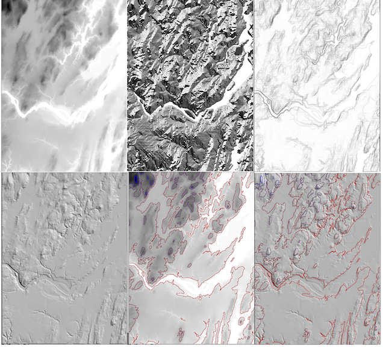
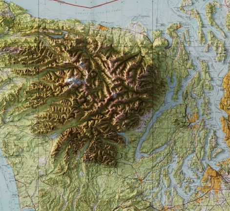

## Project 1:  Visualizing grids

*** 
* __Assigned:__ Thursday, September 14
* __Due:__ Monday, September 25th, 11:59pm
* Group policy: Partner-optional 


In this first project you will write code to  create the following  maps for a grid DEM: 

* a grayscale gradient map of the DEM
* a discrete color map of the DEM using height intervals 
* a gradient color map of the DEM using height intervals 
* a grayscale map of the slope grid 
* a grayscal emap of the aspect grid
* a hillshade map of the DEM
* a gradient color map overlayed on the hillshade
* contour lines overlayed on the grayscale map
* contour lines overlayed on the hillshade




In addition, you will write a brief report containing (1) A brief
description of the dataset you used, location, number of rows and
columns, resolution and provenance; (2) the command line to run your
code; (3) pictures of the maps generated by your code on your test
dataset.  (4) bugs and extra features. (5) Time you spent in: 
Thinking; Programming; Testing; Documenting; Total; (6) Brief reflection
(Prompts (you don't need to address all): how challenging did you find this project? what did you
learn by doing this project?  What did you wish you did differently?
If you worked as a team, how did that go?  What would you like to
explore further?)œ


***

### Overview

If you haven't done so already,  download a dataset (for e.g. from [](https://opentopography.org/) that represents an area you are
interested in and convert it to _arcascii grid_ format. You may be able to download the data directly in this format, otherwise you can convert either through QGIS or using GDAL tools in the command line.

Your code  will read the path of a grid DEM (in _arcascii_ format) on the command line, and will generate  _.bmp_ files, each one corresponding to a map. The output files will have fixed names _out.xxxx.bmp_ and will  be in the current directory (no need to handle a path), like so: 
  
```
(base) ltoma@XVR66RXWMT project1 % ./grid ~/DEMs/brunswick.asc
reading raster /Users/ltoma/DEMs/brunswick.asc
	ncols 387
	nrows 532
	cellsize 26.337635
generating grayscale map..writing out.grayscale.bmp
generating discrete color interval map..writing  out.interval.bmp
generating gradient color interval map..writing  out.interval.bmp
generating slope map..writing out.slope.bmp
generating aspect map..writing out.aspect.bmp
generating hillshade map..writing out.hillshade.bmp
generating shaded relief map..writing out.shadedrelief.bmp
generating contour map..writing out.contour.bm
generating contour map..writing out.contourhillshade.bmp 
```

The conceptual part of the project is making the connection between the elevation of a point in a grid and its color in the various types
of maps you'll be generating. In class we talked in detail about creating grayscale maps, as well as aspect, slope and hillshading
maps. Explanations on the other types of maps are below. Several of the required maps will overlay two maps, for example contours overlayed on the grayscale or hillshade.

The startup code contains a Makefile and files to work with arcascii grids and with a pixel buffer. It also contains a main file which shows how to read in a grid file, create a pixel buffer, put data in it and save it. We went over these in class, and we also went over generating a grayscale map, but it is included below for completeness. It's nice to start a project knowing you already got part 1. 


### Grayscale gradient maps

For grayscale gradient maps, the color of the lowest point in the DEM
is set to {0,0,0}--black and the heighest one to {1,1,1}--white (this can also be done 
the other way around). Points in between _hmin_ and _hmax_ are mapped
based on their height to a color that is a linear interpolation between
the color for the lowest points (black) and the color for the highest point (white).

More precisely,  we map a point of height _h_ to a value _c = (h - hmin)/(hmax-hmin)_, which is between 0 and 1, and we set the RGB color of the point as _{c, c, c}_. Note that an RGB color where the three components are equal is a shade of gray, so this mapping will create a grayscale gradient between black and white.


### Color maps using the height interval 

The idea is to divide the height range in a number of intervals. You can predefine the number of intervals as a constant at the top of your .c file:

```
#define NB_INTERVALS 10
```

You will also need to define a color for each interval. You can  define these as constants, for example: 

```
typedef float Color[3]; 
Color INTERVAL_COLOR[NB_INTERVALS] = {{0,1,1},...};
```

For a discrete map: given a point at height _h_, you  want to find the interval that contains it and then draw the pixel with the color
correponding to that interval.


For a gradient map: In this case you will need one additional color (e.g. for 10 intervals you want 11 color). Instead of defining the
color array to be of size NB_INTERVALS, as above, make it of size NB_INTERVALS +1  (so for the discrete case you will not use the last color). Each interval has two heights that define its range, say _h1_ and _h2_, and two colors, say c_1 = {r1, g1, b1}_ and _c2 = {r2, g2, b2}_ (from the INTERVAL_COLOR array).

When you process a point of height h, we want to find the interval that contains this point, and interpolate the color of this point
between _c1_ and _c2_ using _h_. For example, if _h_ is midway between _h1_ and _h2_, we want its color _c = {r,g,b}_ to be midway between _c1_ and _c2_.


### Slope grid

The slope at a point is given by the magnitude of the gradient (as discussed in class). You want to create a grid to store the slope
(check out _init_grid_ in grid.h), compute the slope, and then create  a grayscale gradient map for it.  Note that here the input to the
grayscale gradient map is not a height grid, but a slope grid. The logic is the same.  It's  a good idea to write a function to create a grayscale gradient grid, something like:

```
void grayscale_map(Grid* grid, PixelBuffer* pb)
```

which you can call when you need it, either with an elevation grid, or a
slope grid, or an aspect grid (below).


### Aspect grid

The aspect is defined as the arc-tangent of the ratio of the y and x partial derivatives.  You need to create an
aspect grid and create a grayscale map for it.  Assuming you wrote your _grayscale_map_ above, you will call it with the aspect grid as
parameter, and then save it to a file called _out.aspect.bmp_.


### Hillshade map

Once the slope and aspect grids are computed, you can compute the hillshade value at a point with the formula from class. You don't need
to create a separate grid (and probably should not --waste of memory), just iterate through the slope and aspect grid, compute the hillshade value, and then write it to the pixel buffer.

Use the default values for sun altitude and azimuth:

```
//for hillshading
float SUN_zenith_deg = 45;
float SUN_azimuth_deg = 315;
```

Creatung a function to do this is highly encouraged. 

An additional feature you can add to the hillshading is the possibility of exagerating the elevations, through a _z_factor_ which you can set at the top.  This has the effect of making the hillshading more dramatic, which can be useful. 

```
#define Z_FACTOR 2
```

You would use this in the function that determines the slope of a point:

```
 float slope = atan(Z_FACTOR* sqrt(dzdx*dzdx + dzdy*dzdy));
```


### Gradient color map overlayed on the hillshade

The goal here is to overlay the gradient interval color map on top of the hillshade, to create something that looks like this:




### Creating contour lines

Given an arbitrary height h and a DEM, a contour line (also: isoline) is the set of all points in the DEM that have height equal to h.

Showing contour lines on top of 2d maps is very common, and is a way to illustrate the topography of the landscape.  The gradient is
perpendicular on the contour line, so looking at the contours we can tell which way water flows.  The steeper the terrain is, the closer
the contour lines will be together. Check out a [topographic map](https://ngmdb.usgs.gov/ht-bin/tv_browse.pl?id=75fc7437432951fa0a445f17b20a515d) from 1895 for Portland, from [USGS topoView](https://ngmdb.usgs.gov/topoview/).


So given a grid and an arbitrary height h, we want to find all the points in the grid at this height. For example, let's say we have a
2x2 grid [1, 1] [3, 3], and we want to find the points at height h=2. We note that none of the 4 sample points in the grid have height
equal to 2. However since neighboring cells have elevation of 1 and 3, it must be that there are points in between them at height 2.  Two points:

* The points on an isoline will fall "in between" grid points. We'll represent them as a set of points (ie vector format).

* Exactly where these points are will depend based on how we model the surface of the terrain between grid points. The two common models used to model grid surfaces are nearest-neighbor and linear interpolation.


For the purpose of visualisation, the exact computation of the points on the contours is not necessary. What you'll do in this project is a
simple approximation: for each grid point (i,j) you will first check it's height h'. If h' is equal to the desired height h of the isoline,
then we consier point (i,j) to be on the isoline.  If h' < h, then you look at its 8 neighbors. If there exists a neighbor with a height h'' such that hh' < h < h"", then it follows that the isoline falls somewhere between thse two points. Rather than computing it exactly,
we consider (i, j) to be on the isoline.

You'll want to write a function that determines if a point is on an isoline:

```
\\return 1 if point (i, j) in grid is on isoline h

\\a point is considered to be on an isoline if (1) it has height equal
to h , or (2) it has height smaller than h and has a neighbor with a
height larger than h.

int is_on_isoline (Grid* grid, int i, int j, float h)
```

Now back to the problem. You want to generate isolines at a fixed interval, predefined as a constant: 

```
#define ISOLINE_INTERVAL 10 
```

And you want to generate isolines starting at _hmin_ + interval. For example, if the interval is 10ft, and the lowest elevation in the grid
is 3 ft, you want to generate isolines at 13, 23, 33, 43, etc. Note that we want to avoid generating an isoline at h=hmin, because when
hmin=0 it will label all low-lying areas and rivers as being on an isoline, so we want to start a little higher.

Remember the goal is to generate a map showing the contours on top of the grayscale gradient and hillshade, respectively. For this you will
need to determine, for an arbitrary point (i,j) in the grid, if it is  on an isoline or not. If a point is not on an isoline, you set its
color as you did for the grayscale map. If a point is on an isoline,  you set its color to be the isoline color (predefined, as a constant at the top).


## What to turn in

* Check in your code to the github repository 
* Message me the printed report, by the deadline. 


### Final remarks

A nice feature of this first project is that it is incremental-- the maps can be created one at a time, so it is easy to break it into
parts and work on one part at a time without being overwhelmed.

Even though no part of the project is difficult, starting late will certainly make it so. Plan accordingly.

Program well, and enjoy!
