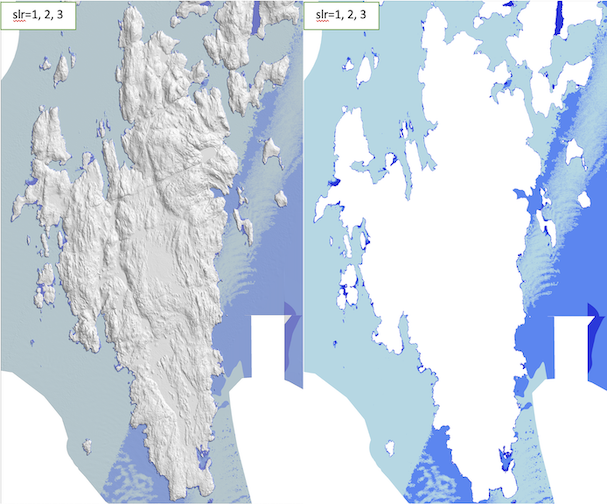
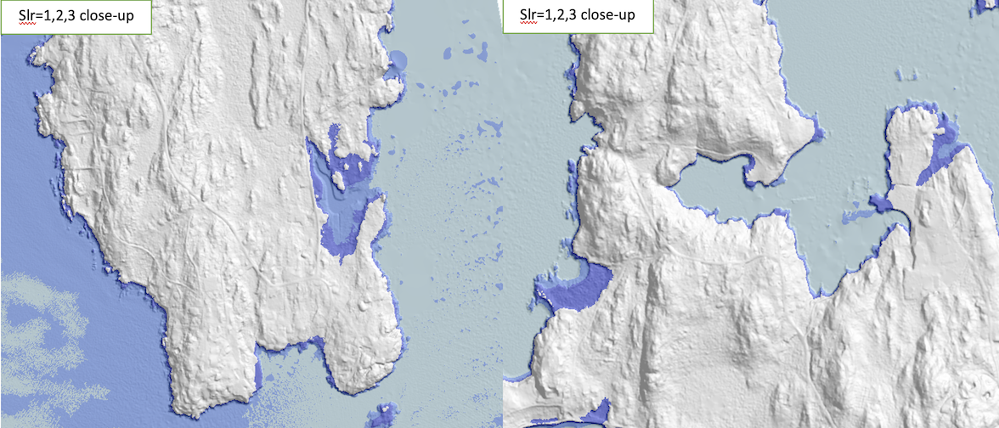
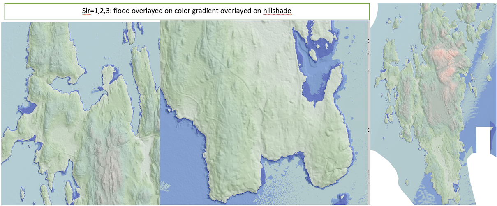

## Project 2:  Sea-level rise flooding 

*** 
* __Assigned:__ Tuesday, September 26
* __Due:__ Friday October 6th, 4pm <--- Note: right before fall break
* Group policy: Partner-optional

In this project you will develop a program to compute and visualize the incremental flooding caused by sea-level rise, and write a report to showcase your work.  


__Input__: the name of an elevation grid, the name of the flooded grid, an SLR value and an SLR increment.

Your program will read the elevation grid and compute the flooding starting at SLR =
_slr_increment_, going up by _slr_increment_, up to desired SLR value. 

For example, if the SLR value is 2 and the increment value is .5, you
will compute flooding for slr = .5, slr=1, slr=1.5 and slr=2. If the
SLR value is 3 and the increment is 1, you will compute flooding for
slr = 1, slr = 2 and slr = 3.


__Output:__ A flooded grid; The SLR value that gives the largest incremental change; Some maps. 


* _The flooded grid:_ The program will create a flooded grid which records  what parts of the terrain will be flooded and at what SLR
value. 

For example, when flooding with  SLR value = 3 and increment = 1, each point in the flooded grid  should be set to:

	* 1 if the point is land  but  gets flooded at slr = 1;
	* 2 is the point is land and not flooded at slr=1, but gets flooded at slr=2
	* 3 if the poimt is land and not flooded at slr = 2, but gets flooded at slr = 3
	* _nodata_ otherwise 

Note that a point being set to _nodata_ in the flooded grid means that the point does not flood.   This could be
because the elevation of the point is _nodata_, or because the point is land but either it is not reachable by the flood,  or,  it is reached
by the flood but its elevation is larger than the SLR value.  In other words, the flooded grid records whether a point floods, not whether a poit is water.


* _The largest incremental change:_ The program will compute the SLR which causes the largest number of flooded points. For example,

```
compute SLR flooding up to slr=3.0 (incr=1.0)
	findBoundarySea: rise=1.0, min elev=0.2, nb.bnd.nodata = 3659, returns 8333 bnd sea points
	At slr =1.0:  flooding    2761813 new cells
	At slr =2.0:  flooding     928935 new cells
	At slr =3.0:  flooding     117043 new cells
total nb. cells flooded: 3807791 (46.81 percent)
largest flood is from slr=0.0 to slr=1.0, total 2761813 cells
```


* _Maps:_ You will create the following maps: 

	* map.hilshade.bmp:  hillshade of the elevation grid  
	* map.elev-over-hillshade.bmp: elevation grid color gradient overlayed on hillshade 
	* map.flooded.colordiscrete.bmp: flooded grid, with discrete colors 
	* map.flooded-over-hillshade.bmp: flooded grid with discrete colors overlayed on hillshade





### Datasets


First you will want to download a dataset (for e.g. from [OpenTopo](
https://opentopography.org/) that contains coastline. If the dataset
you used for project 1 has coastline, you are all set. Otherwise you
need to download a new one.


_Test dataset:_ You can download the dataset I used to generate the
maps on this page
[here](https://tildesites.bowdoin.edu/~ltoma/DEM/southport.asc). It
covers the Southport Island off the coast of Maine, it is obtained
from Lidar, it has 2214 cols and 3674 rows, and 2m resolution.

[TO DO: UPLOAD SOUTHPORT.ASC]


### The interface 

Your code will read on the command line the name of an elevation grid,
the name of a flooded grid, an SLR value and an SLR increment. 

For example, 

```
%./slr ~/DEM/southport.asc southport-flooded.asc 3 1
```

This will flood _southport.asc_ with _slr = 1, 2, 3_ and write the
output flooded grid in a file in the current directory called
_southport-flooded.asc_.


You can assume they are in this order, and therefore the name of the
elevation grid will be in _argv[1]_, the name of the flooded grid will
be in _argv[2]_, the SLR value will be in _argv[3]_ and the SLR
increment in _argv[4]_.


_Optional:_ Ideally reading the command line parameters should be done
with the _getopt()_ function, which will allow to enter these params
in arbitrary order. For example,

```
% ./slr -e ~/DEMs/southport.asc -o southport-flooded.asc -r 3  -i 1
```


### Computing the SLR flooding

For these examples we will assume that we want to compute flooding up to slr = 3 in increments of 1. 

In class you came up with two approaches, one recursive and one BFS-like. Because we want to flood incrementally
--- first at slr = 1, then at slr = 2, then at slr = 3 --- the BFS approach will work more efficiently.


### Flooding at slr = 1. 

For the initial flood you will want to traverse the boundary of the
grid, find all points that are _nodata_ (to deal with datasets that don't have NODATA on the boundary, I added this: OR, their elevation is < rise) and put them in a queue. These will be the "sources" of the flooding.

To compute the flooding, we'll need to keep track of what points have  been visited, and for that we'll use the flooded grid (so it needs to be initialized as _NOT_VISITED_).   We will repeatedly pop a point from the queue and check  all its neighbors; we  push the neighbors that are unvisited and flooded to the queue, so that the flood propagates further. 

* if the neighbor has already been visited: there's nothing to do, continue

* if the neighbor has not been visited, and it's elevation is
 _nodata_: add it to the queue and mark it as SEA 

* if the neighbor has not been visited and its elevation < slr:  add
  it to the queue and mark it as flooded at this level.

When the queue is empty, flooding is done.


At the end of the flooding process, the points in the flooded grid will be marked as : 
not visited (not reached by the flood); sea; flooded; not flooded (elevation above
rise). Since the flooded grid must be set to nodata for all points but the ones that flood, you need to do one final traversal through the flooded grid and set all points that are not flooded to nodata. 


### Incremental flooding

After flooding with slr = 1 we would like to continue with slr = 2. Obviously we could repeat the flooding process, this time with slr = 2. Can we do better?  Could we base flooding at slr = 2 on the flooding at slr = 1, without starting it all over again?

Once you think about it, the idea is quite natural: To flood at slr = 2,
we want to start from the boundary of the flood at slr = 1 --- namely the
points that were visited and not flooded for slr = 1. So if we ask
flooding at slr = 1 to produce the boundary of its flood, we can use it
to start the flooding at slr = 2.

And so on.

Based on this insight, your function to compute the flood at a given slr will take as a parameter the queue that contains the starting boundary of the flood, and will compute and
return a queue that contains the ending boundary of the flood.  This
queue will be used as the starting boundary for the next slr level.  It
will look something like this:

```
bnd_queue = all points on the boundary of the grid that are _nodata_
for (rise = slr_incr; rise <= slr_final; rise += slr_incr) {
    bnd_queue = compute_flood(elev_grid, flooded_grid, rise, bnd_queue, ...) 
} 
```


### Largest incremental flood 


As you compute each flood level,  you will want to keep track of how many points are flooded at that level, and the overall largest flood.  For example, 


```
compute SLR flooding up to slr=3.0 (incr=1.0)
	findBoundarySea: rise=1.0, min elev=0.2, nb.bnd.nodata = 3659, returns 8333 bnd sea points
	At slr =1.0:  flooding    2761813 new cells
	At slr =2.0:  flooding     928935 new cells
	At slr =3.0:  flooding     117043 new cells
total nb. cells flooded: 3807791 (46.81 percent)
largest flood is from slr=0.0 to slr=1.0, total 2761813 cells
```


### The flooded grid


You will want to create the flooded grid to be the same as the elevation grid, which can be easily done using the _grid_init_from()_ function provided in _grid.c_:

```
 //create the flooded grid 
  Grid * flooded_grid = grid_init_from(elev_grid);

  //flood
  compute_flood_incrementally(elev_grid, flooded_grid, slr_final, slr_incr); 
```

At the end you will save the flooded grid (in arcascii format) using
the function in _grid.c_:

```
  //write flooded grid 
  printf("writing %s\n", flooded_name); 
  grid_write_to_file(flooded_name, flooded_grid);
  grid_print_stats(flooded_grid);
```


### Visualizing the flooding

In addition to the hillshade of the elevation grid, and the shaded relief
(color gradient overlayed on hillshade), you will create  two maps to
visualize the flooding:

* map.flooded.colordiscrete.bmp: flooded grid, with discrete colors

This is the same type of discrete color map based on value intervals
that you created for project 1. I did write a separate function for
this just because I wanted blue colors.

```
/* classify the values in the grid in intervals and map each
  interval to a different (blue) color. Set the pixel buffer corresponding
  to these colors. 
*/
void grid_flood_to_pixelbuffer(const Grid* grid, PixelBuffer pb)

```

A quick search for the color blue led me to [this site]
(https://html-color.codes/blue) where I picked some shades of blue,
for e.g..


```
//here I chose a map of 4 colors
Color BLUE[4] = {
  {.68, .85, .90}, //light blue rgb(173,216,230) 
  {.31, .53, .97}, //royal rgb(79,134,247)
  {.15, .23, .89}, //palatinate rgb(39,59,226)
  {.64, .76, .68} //cambridge blue
} ;
```
Note that 4 colors may not be enough for the flooded grid (for example, if we flood with slr=10, incr=1, we will get values 1 through 10). In the _grid_flood_to_pixelbuffer_ function,  flood values  <= 4 are colored with BLUE, and values above 4 are colored  with random colors. Basically the first step in this function is to generate a color array, which is BLUE[i] for i=1,2,3,4 and a random color for i >4.  Then a value of x in the flooded grid will be colored with color[x]. 

* map.flooded-over-hillshade.bmp: flooded grid with discrete colors overlayed on hillshade

This is the same type of map you did for project1.  Consider implementing a function to overlay two pixel buffers, like so:

```
/* overlay pb2 on top of pb1, with transparency alpha. 
   Interpolate between pb1 and pb2 based on alpha: If alpha=1, show pb1; if alpha=0, show pb2.
   Write the output in pb1. 
*/
void pixelbuffer_overlay(PixelBuffer pb1, PixelBuffer pb2, float alpha) 
```

To overlay the flooded grid on the hillshade you can call it like so:

```
  PixelBuffer pb1, pb2;
  ...
  //create  bitmap  for hillshade 
  grid_hillshade_to_pixelbuffer(hillshade_grid, pb1);

  //flooded grid, colors intervals discrete
  grid_flood_to_pixelbuffer(flooded_grid, pb2, ..);
  printf("writing map.flooded.colordiscrete\n"); 
  save_pixel_buffer_to_file(&pb2, "map.flooded.colordiscrete.bmp");

  alpha = .5;
  pixelbuffer_overlay(pb1, pb2, alpha);
  printf("writing map.flooded-over-hillshade.bmp\n"); 
  save_pixel_buffer_to_file(&pb1, "map.flooded-over-hillshade.bmp");
  ...
```


***

### More implementation details


### Dependency structure

Good coding practices recommend breaking the code into files that
encapsulate parts of the functionality, similar to how you would break
your code into classes (remember Data Structures projects).

These are the files that were given with last project, which you'll use  again: 

* stb_image_write.h
* grid.h, grid.c
* pixel_buffer.h, pixel_buffer.c 


Plan to create the following additional files: 

* map.h, map.c
* flood.hpp, flood.cpp
* slrmain.c 


__map.{h,c}:__  All functions to create bitmaps from grids. Need  to include grid.h,  pixel_buffer.h

__flood.{hpp, cpp}:__ Functions to compute the flood. Include grid.h 

__slrmain.c:__ The main() function is here.  Read parameters from user, create grids, compute the flood and create the bitmaps. Include grid.h, map.h, flood.hpp 


Note that the flood files need to use a queue, which is a c++
structure. Currently the compiler allows that you mix c and c++ code
in a project (although you'll get a warning).

A good place to start is by copying all code from project1 over into
project2. Move all functions for creating bitmaps into _map.c_ and
create a header file for it, _map.h_.  Then create a file _slrmain.c_
where you add a main function --- here you will eventually call
functions to create and visualize the flooding. As you get things to
compile, start with an empty main function, and then gradually add
code to open a grid, create maps and so on.

You will also need to modify the Makefile, and here is the first part:

```
#DEBUG MODE 
CFLAGS = -m64 -Winline -g -O3 -Wall
CC = g++ $(CFLAGS)

slr:  slrmain.o flood.o map.o pixel_buffer.o grid.o 
        $(CC) -o $@ slrmain.o flood.o map.o pixel_buffer.o grid.o $(LIBS)

slrmain.o: slrmain.c flood.hpp grid.h  map.h pixel_buffer.h stb_image_write.h
        $(CC) $(CFLAGS) -o $@ -c slrmain.c 
...
###fill in the rest  
```


### Working with a queue in c++

You can use the queue in C++: 

```
#include <queue>

std::queue<point> bndqueue;
```

You can push and pop elements into/from the queue  in the usual way: 

```
while  (!queue.empty()) {
    
    //pop the next point in the queue 
    currPoint  = queue.front();
    queue.pop();
    
} 
```

Note that  the queue is provided in C++, so the files that use queues will need to have _{.hpp, .cpp}  extensions and be compiled with g++ (rather than gcc). 


***

### The Report 

You will write a  report showcasing your work.  Include: 

1. The dataset you used, location, number of rows and columns, resolution and provenance. 

1. Results 
* run your code with southport.asc, slr=3, incr=1 and show the maximum flood reported
* run your code with southport.asc, slr=20, incr=1 and show the maximum flood reported
* run your code with YOUR_DATASET.asc, slr=3, incr=1 and show the maximum flood reported
* run your code with YOUR-DATASET.asc, slr=20, incr=1 and show the maximum flood reported

1. Maps 
* for southport
  - hillshade
  - color gradient over hillshade
  - slr=3, incr=1: flooded-discrete, and flooded-discrete-over-hillshade
  - slr=20, incr=1: flooded-discrete, and flooded-discrete-over-hillshade
* for YOUR-DATASET
  - hillshade
  - color gradient over hillshade
  - slr=3, incr=1: flooded-discrete, and flooded-discrete-over-hillshade
  - slr=20, incr=1: flooded-discrete, and flooded-discrete-over-hillshade

1. Bugs and extra features. 

1. Effort

   Time you spent in: thinking, Programming; Testing; documenting; total.

1. Reflection

Prompts: how challenging did you find this project? what did you
learn by doing this project?  What did you wish you did differently?
If you worked as a team, how did that go?  What would you like to
explore further? --- you don't need to address all. 


***


### What to turn in

* Check in your code to the github repository 
* Message me the report. 

***

### Final remarks

There are many small steps to this project, and starting early and making progress every day is important so that you learning
is rewarding and enjoyable.  Coding projects can quickly become overwhelming if put off too
long.  Think one piece at a time, and remember you are not expected to
have worked on larger projects before --- this is an opportunity to
learn.


A 3000-level class means you work towards being independent and debugging your code independently.  Use the internet as much as you can, to answer your questions on how to do things in C/C++, syntax and so on. Write code incrementally, in small pieces at a time, so that you always know
where the error is coming from. Use the bitmaps and prints to know what you are computing at all times.

Enjoy! 


***

### Results for Southport





```
compute SLR flooding up to slr=5.0 (incr=1.0)
	findBoundarySea: rise=1.0, min elev=0.2, nb.bnd.nodata = 3659, returns 8333 bnd sea points
	At slr =1.0:  flooding    2761813 new cells
	At slr =2.0:  flooding     928935 new cells
	At slr =3.0:  flooding     117043 new cells
	At slr =4.0:  flooding     155553 new cells
	At slr =5.0:  flooding     190139 new cells
total nb. cells flooded: 4153483 (51.06 percent)
largest flood is from slr=0.0 to slr=1.0, total 2761813 cells
```
  
```
 compute SLR flooding up to slr=20.0 (incr=1.0)
	findBoundarySea: rise=1.0, min elev=0.2, nb.bnd.nodata = 3659, returns 8333 bnd sea points
	At slr =1.0:  flooding    2761813 new cells
	At slr =2.0:  flooding     928935 new cells
	At slr =3.0:  flooding     117043 new cells
	At slr =4.0:  flooding     155553 new cells
	At slr =5.0:  flooding     190139 new cells
	At slr =6.0:  flooding     181074 new cells
	At slr =7.0:  flooding     179454 new cells
	At slr =8.0:  flooding     164275 new cells
	At slr =9.0:  flooding     157622 new cells
	At slr =10.0:  flooding     140891 new cells
	At slr =11.0:  flooding     138100 new cells
	At slr =12.0:  flooding     146128 new cells
	At slr =13.0:  flooding     135700 new cells
	At slr =14.0:  flooding     125785 new cells
	At slr =15.0:  flooding     126373 new cells
	At slr =16.0:  flooding     120901 new cells
	At slr =17.0:  flooding     100824 new cells
	At slr =18.0:  flooding      89243 new cells
	At slr =19.0:  flooding      82788 new cells
	At slr =20.0:  flooding      90665 new cells
total nb. cells flooded: 6133306 (75.40 percent)
largest flood is from slr=0.0 to slr=1.0, total 2761813 cells
```


