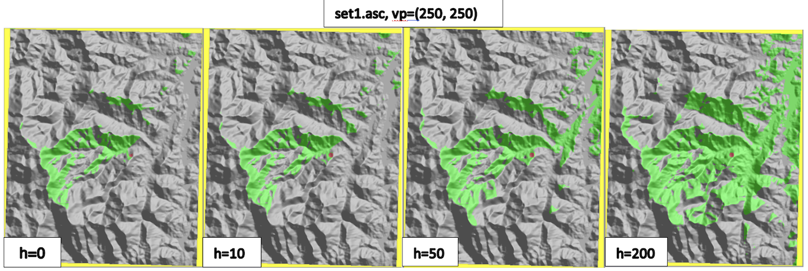
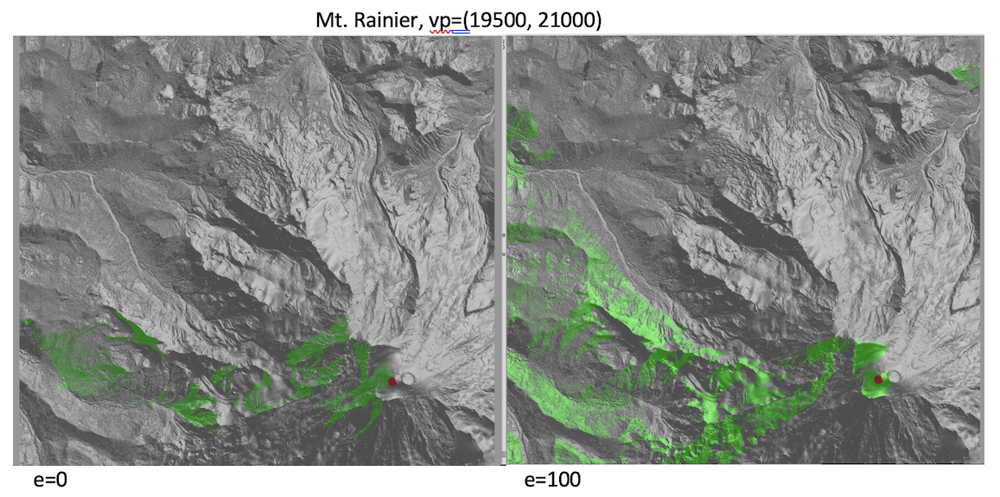
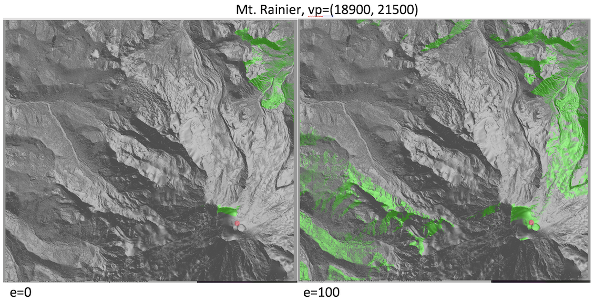
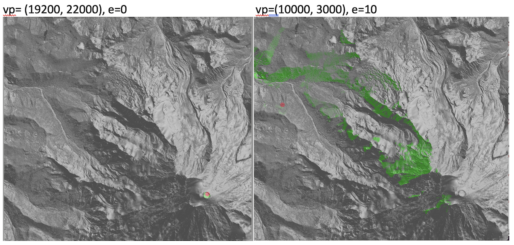

## Project 4:  Visibility on Terrains  


*** 
* __Assigned:__ Saturday, October 28
* __Due:__ Wednesday  November 8th 
* Group policy: Partner-optional

***

Have you ever wondered what would be the view from the top of  Mt. Rainier at 14,410 ft?  In this project you will (partially) answer this question, with several days of work and sweat over debugging, but without the strenous and difficult climb:   You will write code to compute the viewshed of an arbitrary  point on a terrain, download high resolution data for Mt. Rainier from OpenTopo, and use your code to compute viewsheds  of points that fall approximately on the top. 

Some interesting facts from NASA about [Mt. Rainier](https://earthobservatory.nasa.gov/images/145548/mount-rainier).

__Input:__ As input, your code will take the name of an elevation grid, the coordinates (r,c) of the viewpoint, the elevation of the viewpoint above the terrain, and the name of the viewshed grid to be created. 

__Output:__ Your code will compute the viewshed of the point (r,c) standing at the given elevation above ground level, and save it as an ascii grid in a file with the specified name.  It will print the size of the viewshed (nb. of points that are visible).  And it will  create and save a bitmap of this viewshed,  overlayed onto the elevation hillshade.  


### The interface 

For example, running with

```
./vis -e ~/DEMs/rainier.asc -v  vis.asc  -r 1000 -c 1000 -h 10 
```
or
```
./flow ~/DEMs/rainier.asc vis.asc 1000 1000 10 
```
will compute the viewshed of point (r=1000, c=1000), standing 10 above ground level, and save the viewshed grid as _vis.asc_. 


### Datasets 

To start you can use any of the datasets  from previous projects.  

Test datasets: You can download the datasets [here](https://tildesites.bowdoin.edu/~ltoma/teaching/DEM/)

Eventually you will run your code on Mt. Rainier,  which you can download directly from [OpenTopography](https://portal.opentopography.org/datasetMetadata?otCollectionID=OT.072023.26910.2). I have downloaded a dataset  which I'll share with all of you so that we can compare results.  It has _ncols=26765_ and _nrows=24286_, at below 1m resolution, for a total _n = 650M_ points. 


### Algorithm

We talked about three different algorithms to compute  the viewshed of a point: 
* The straightforward algorithm
* The radial-sweep algorithm proposed by [Van Kreveld](). 
* The algorithm that computes horizons in a concentric sweep

The radial sweep algorithm assumes cells have constant altitude/zenith throughout their span, which creates some artifacts in practice. So we are not going to use this algorithm.   

The concentric sweep algorithm  involves merging horizons which in turn involves computing intersection of segments on the horizon. This is tricky to write and get all special cases correct. Furthermore determining if a point is visible comes down to determining if a point is above or below a segment of the horizon, which is numerically unstable when points are very close to lines. So we are not going to use this algorithm either.   

For this project you will implement the first algorithm: given a viewpoint _v_, traverse the grid and for each point _p_, determine if _p_ is visible from _v_.  As discussed in class, there are a couple of steps: 
* find all the intersection points _q_ between the horizonal projection of the segment _vp_ and the grid lines
* for each such point _q_ interpolate its height based on the grid segment it is on and compute the altitude of _q_ with respect to _v_
* point _p_ is visible if all the intersection points have the altitude below the altitude of _p_, and invisible otherwise. 


### Overview

The structure of the code is fairly simple.  You will start by reading the command line arguments (and printing them).  

```
(base) ltoma@XVR66RXWMT code % ./vis -e ~/DEMs/set1-30m.asc -r 100 -c 100 -v vis.asc 
running with arguments:
	elev_name: /Users/ltoma/DEMs/set1-30m.asc 
	vis_name: foo.asc
	vp=(100, 100, 0.0)
```

Then you will read the elevation gri,  print some basic information about it (grid.c has a function to do this), and create a hillshade bitmap (note:  my Mt. Rainier hillshade looked reversed, which is either because something is reverted in my code, or it is a visual effect. In any case,  I generated a gradient colormap on the hillshade which looked better).

You will create and initialize a viewshed grid, compute the viewshed,  create a bitmap overlayed on the hillshade of the terrain and save the viewshed  grid to disk (grid.c has a function to do that). Finally you will free the memory for the grids and the pixel buffers.
```
compute_viewshed_grid(elev_grid, vis_grid, vr, vc, vh);
// create bitmap "map.vis-over-hillshade.bmp"
//save vis_grid to ascii file
//free grid 
```

The computation of the viewshed grid is encapsulated in this function: 
```
/*
 elev_grid: input elevation grid
 vis_grid: output viewshed grid, initialized to 0
 vr, vc, vh: viewpoint row, column, height
 populates vis_grid with values, a point is set to 1 if its visible from (vr,vc,vh)
*/
void compute_viewshed_grid(const Grid* elev_grid, Grid* vis_grid, int vr, int vc, int vh);
```


Note that its a good idea to initialize the viewshed grid as 0 (not visible), and update the points that are visible to 1.  Viewsheds are usually (very) small, so it is more efficient to  initialize all the grid as invisible and turn the visible points to 1 (visible), then the other way around. 

```
const int VISIBLE = 1;
const int NOT_VISIBL = 0; 
```
To determine what points are visible, ```compute_viewshed_grid``` will call another function:

```
/*
 elev_grid: input elevation grid
 r,c: row and column 
 vr, vc, vh: viewpoint row, column, height
 returns 1 if point (r,c) is visible from (vr,vc,vh)
 returns 0 otherwise 
*/
int is_point_visible(Grid* elev_grid, int r, int c, int vr, int vc, int vh); 
```

This function is where you'll spend most of your time. 


### Structure of your code 

To work with grids and pixel buffers you will use the same files as before: 

* stb_image_write.h
* pixel_buffer.h, pixel_buffer.c
* grid.h, grid.c

From the previous project you’ll use:

* map.h, map.c: Need to include grid.h and pixel_buffer.h. All functions to create bitmaps from grids are here.  
    	If you want to create a separate function to visualize a viewshed grid, you will  add it here. 

You’ll create the following additional files:

* vis.hpp, vis.cpp: Need to include grid.h. All the functions to compute the viewshed are here. 
          The main functions that you need to implement are in the header, but you will need to add more helper functions.
   
* vismain.c: The main() function is here. Read command line arguments from the user, create the viewshed grid,  
          and create the bitmaps. Includes grid.h, map.h, vis.hpp.

Once you accept the code on github classroom, a good place to start is writing your ```main()``` in ```vismain.c```:  read the command line arguments, read the elevation grid and create the hillshade map, create the viewshed grid and compute it. As you get things to compile, start with an empty ```compute_viewshed_grid()```function, and then gradually add the code in, one small piece at a time. 

You will spend most of your time writing the ```is_point_visible(..)``` function.  Start by computing only  the intersection with the horizontal grid lines; the viewshed you will see will be larger than the real one, because it is only filtering through half  of the terrain.  Once you add the intersections with the vertical segments (the other half), this will mark some of the points that were previously visible  as invisible, so your viewshed will shrink to a smaller size. 


### Working with large data 

A new piece in this project will be working with a large dataset.  The Mt. Rainier dataset has a little over 650 million points and the ascii file _mtrainier.asc_ uses 11GB of disk space.  When you load it as a grid in memory, which stores  elevation as a _float_,  the elevation grid will occupy 4 x 650M = 2.6GB of memory.  This is large!   (Obviously, you do not want to test your code on this large dataset until it works smoothly on the smaller sets.) 

The theoretical complexity of the viewshed algorithm is $O(n \sqrt n)$. This is evaluated as the total number of instructions executed by the algorithm assuming that: 
* all data fits in memory
* all memory accesses take the same amount of time
* all instructions take the same amount of time.

Theoretical complexity  is expressed using asymptotic notation,  which hides all the constants in the running time. 
Algorithms that are in the same class of asymptotic complexity  are considered equivalent.  There are two reasons for doing this: First, counting instructions while assuming all instructions are equal  means the constants are not accurate anyways. Second, by ignoring the constants the emphasis is placed on optimizing at the algorithmic level first,  which should always be the first step. 

In practice, these assumptions are not completely accurate and the running time will also depend on the type of instructions executed (some instructions are slower) and on the number and type of memory accesses.

__Instructions are not all equal:__  When your code needs to work with large datasets, small variations in the number and type of instructions will have a large impact on the running time. One more expensive instruction, if executed 600 million times, will add significant extra time to your code.   Be aware of the expensive instructions vs cheap instrictions.  Multiplying or dividing by two, addition, increment --- all these are instructions that run in a few clock cycles or machine instructions.  Instructions like division and multiplications are more expensive. And library functions like computing trigonometric functions, arc tangents, and so one take 100 cycles or so.  If we can avoid using these the code will get a big speed up.  

Extra challenge: If you want to dig more into code optimization, check out using a profiler tool, which will give you exact statistics on how many times each function in the code is called and what percentage of the running time it makes up for. The rule of thumb is that you do not want to optimize a function that makes up for a small percentage of the total running time.  You will want to focus your efforts on the function that has most impact on the running time. 

__Memory efficiency:__   Data is stored in a hirarchy of caches, and the difference in speed between accessing data in cache versus main memory versus extenal memory can be several orders of magnitude.  Be aware of the memory footprint of your code (how much RAM it uses at any given time).  The elevation grid and the viewshed grid will both have to be in memory, which will be around 5.2GB of RAM.  If your code uses a hillshade grid, that's 2.6GB more.   In this case, plan it so that the hillshade and the viewshed grid do not exist at the same time, i.e.  create the hillshade grid and the hillshade bitmap and then delete the hillshade grid, __before__ you create the visibilty grid (not that the hillshade grid can be deleted once you copied it into the pixel buffer).   In addition to the elevation and viewshed grids, you will also need two pixel buffers, which are also large. 

So the main thing  is to be aware of the main memory (RAM) footprint of your code especially as compared to  the size of the main memory on your laptop. If for other project you did not worry about freeing memory, for this one you will want to delete a grid and a buffer as soon as you don't need them. If the memory footprint is larger than the available RAM, the system will place the data onto external memory, which will be 2-3 orders of magnitude slower to access than main  memory. 


### Fastest code award 

We will have prizes for the fastest code! Stay tuned for details.  

### The Report

You will write a report showcasing your work including:

1. The dataset you used, location, number of rows and columns, resolution and provenance.
1. Results. Run your code with set1.asc and YOUR_DATASET.asc on a well chosen viewpoint. 
1. Maps. For each dataset create viewshed-over-hillshade bitmap.  Note that if the bitmaps are large you should NOT add them to the repository (github won’t let you anyways).
1. Bugs and extra features.
1. Effort. Time you spent in: thinking, Programming; Testing; documenting; total.
1. Reflection. Prompts: how challenging did you find this project? what did you learn by doing this project? What did you wish you did differently? If you worked as a team, how did that go? What would you like to explore further? — you don’t need to address all.


### What to turn in

    Check in your code to the github repository
    Message me the report.

### Final remarks

As always, starting early and making progress every day is important so that your learning is rewarding and enjoyable. Coding projects become overwhelming if put off too long. Think one piece at a time, and remember this is an opportunity to learn.

A 3000-level class means you work towards being independent and debugging your code independently. Use the internet as much as you can, to answer your questions on how to do things in C/C++, syntax and so on. Write code incrementally, in small pieces at a time, so that you always know where the error is coming from. Use the bitmaps and prints to know what you are computing at all times.

Put differently, if you don’t start early, you likely won’t be able to finish, and if you don’t approach coding incrementally, you likely won’t be able to debug your code. 

Enjoy!


## Results 



set1 viewshed size: 

```
Set1 vp=(250, 250)
h=0:   viewshed size=11978
h=10:  viewshed size=14486
h=50:  viewshed size=25327
h=200: viewshed size=52570
```


Southport viewshed sizes: 
```
southport vp=(1000, 1000)
e=0:  viewshed size=555941
e=10: viewshed size=1059023
e=50: viewshed size=3669179
```


For Mt. Rainier, it turns out it is not easy to find a spot on the rim of the crater with good visibility of the surroundings. Inside the crater  all you can see is the crater.  Outside the crater there are deep valleys and rims which obstruct the view.  
Finding a point at the foothills of the mountain with good visibility of the top crater is not straightforward either ---- I  tried a few points but none had a good view of the crater.  

Below are some of the attempts. Reading a grid in memory takes about 180 seconds, and computing the viewshed takes 30-40 seconds. 








