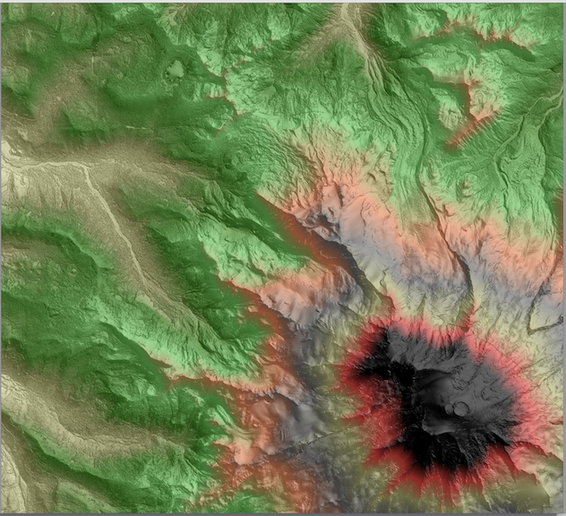
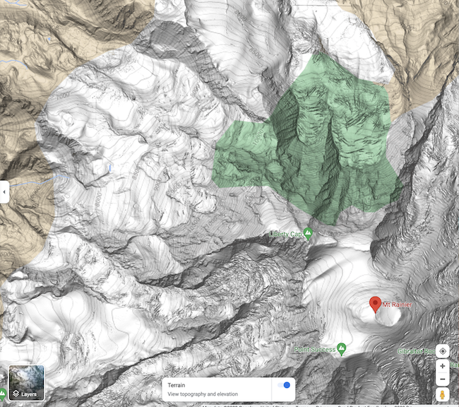

[IN PROGRESS] 

## Project 4:  Visibility on Terrains  


*** 
* __Assigned:__ Friday, October 27
* __Due:__ Tuesday  October 31st 
* Group policy: Partner-optional

***

Have you ever wondered what would be the view from the top of  Mt. Rainier?  In this project you will (partially) answer this question, with lots of sweat and several days of work, but without the climb:   You will write code to compute the viewshed of an arbitrary  point on a terrain, download high resolution data for Mt. Rainier from OpenTopo, and use your code to compute viewsheds  of points that fall approximately on the top. 

__Input:__ As input, your code will take the name of an elevation grid, the coordinates (r,c) of the viewpoint, the elevation of the viewpoint above the terrain, and the name of the viewshed grid to be created. 

__Output:__ Your code will compute the viewshed of the point (r,c) standing at the given elevation above ground level, and save it as an ascii grid in a file with the specified name.  It will print the size of the viewshed (nb. of points that are visible).  And it will  create and save a bitmap of this viewshed,  overlayed onto the elevation hillshade.  


### The interface 

For example, running with

```
./vis -e ~/DEMs/rainier.asc -v  vis.asc  -r 1000 -c 1000 -h 10 
```

or
```
./flow ~/DEMs/rainier.asc vis.asc 1000 1000 10 
```
will compute the viewshed of point (r=1000, c=1000), standing 10 above ground level, and save the viewshed grid as _vis.asc_. 


### Datasets 

To start you can use any of the datasets  from previous projects.  

Test datasets: You can download the datasets [here](https://tildesites.bowdoin.edu/~ltoma/teaching/DEM/)

Eventually you will run your code on Mt. Rainier,  which you can download directly from [OpenTopography](https://portal.opentopography.org/datasetMetadata?otCollectionID=OT.072023.26910.2). I have downloaded a dataset  which I'll share with all of you so that we can compare results.  It has _ncols=26765_ and _nrows=24286_, at below 1m resolution, for a total _n = 650M_ points. 




### Algorithm

We talked about three different algorithms to compute  the viewshed of a point: 
* The straightforward algorithm
* The radial-sweep algorithm proposed by [Van Kreveld](). 
* The algorithm that computes horizons in a concentric sweep

The radial sweep algorithm assumes cells have constant altitude/zenith throughout their span, which creates some artifacts in practice. So we are not going to use this algorithm.   

The concentric sweep algorithm  involves merging horizons which in turn involves computing intersection of segments on the horizon. This is tricky to write and get all special cases correct. Furthermore determining if a point is visible comes down to determining if a point is above or below a segment of the horizon, which is numerically unstable when points are very close to lines. So we are not going to use this algorithm either.   

For this project you will implement the first algorithm: given a viewpoint _v_, traverse the grid and for each point _p_, determine if _p_ is visible from _v_.  As discussed in class, there are a couple of steps: 
* find all the intersection points _q_ between the horizonal projection of the segment _vp_ and the grid lines
* for each such point _q_ interpolate its height based on the grid segment it is on and compute the altitude of _q_ with respect to _v_
* point _p_ is visible if all the intersection points have the altitude below the altitude of _p_, and invisible otherwise. 


