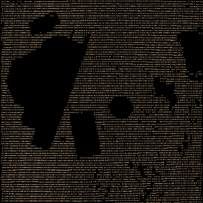
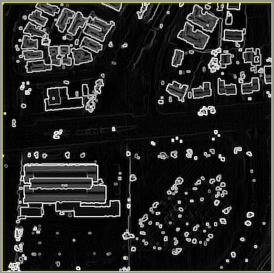
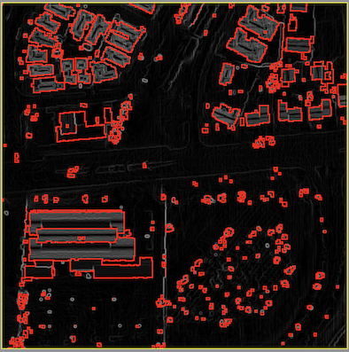

## Project 6: Classifying Lidar data   


*** 
* __Due:__ by Saturday  December 16th, 1pm
* Group policy: Partner-optional

***

### Dataset ```france.las```

```
./main data/france.txt      
read total 101206 points
	bounding box:  x=[876734.00, 876834.00], y=[2260797.00,2260897.00], z=[348.28,362.93]
lidar_to_dsm:
	n=101206, sqrt(n) =318, corresponding cell_x = 0.3, cell_y=0.314
	starting with: nrows = 319,  ncols =319, cellsize = 0.314
	nb.last returns: 92755 (out of 101206 total points)
	#points/cell     #cells
	         0      37843
	         1      41018
	         2      18167
	         3       4006
	         4        535
	         5         93
	         6         34
	         7         20
	         8         16
	         9          9
	        10          8
	        11          3
	        12          6
	        13          1
	        14          1
	        15          1
	     total      92755
	       avg       0.91 (nb.points/cells)
	       avg       1.45 (nb.points/non-empty cells)
	grid size accepted.
lidar_to_dsm: done
grid dsm (0x600000658000):
	n=101761 [rows=319,cols=319], range=[348.28, 362.93], avg value=352.9 nodata=37843 (37.2%)
writing map.dsm-grayscale.bmp

```


****

### Dataset ```house.las```

```
(base) ltoma@XVR66RXWMT code % ./main data/house.txt 
read total 57084 points
	bounding box:  x=[309227.00, 309269.00], y=[6143455.00,6143497.00], z=[451.40,471.39]
lidar_to_dsm:
	n=57084, sqrt(n) =238, corresponding cell_x = 0.2, cell_y=0.176
	starting with: nrows = 239,  ncols =239, cellsize = 0.176
	nb.last returns: 36605 (out of 57084 total points)
	#points/cell     #cells
	         0      43135
	         1       2312
	         2       2496
	         3       7650
	         4       1363
	         5        107
	         6         43
	         7         14
	         8          1
	     total      36605
	       avg       0.64 (nb.points/cells)
	       avg       2.62 (nb.points/non-empty cells)
	grid size accepted.
lidar_to_dsm: done

grid dsm (0x6000018e4000):
	n=57121 [rows=239,cols=239], range=[451.40, 471.14], avg value=459.1 nodata=43135 (75.5%)
writing map.dsm-grayscale.bmp
lidar_to_bareground:
erode
erode
dilate
writing map.dtm1.hillshade.bmp
generate_slope:
grid slope_grid: (0x6000018e9350):
	n=57121 [rows=239,cols=239], range=[0.00, 1.52], avg value=0.3 nodata=1356 (2.4%)
writing map.slope-on-hillshade.bmp
writing map.ground-hillshade.bmp
dilate nodata
dilate nodata
writing map.ground-hillshade.bmp
interpolate_dtm_grid: 
	added 3177 points to the queue
interpolate_dtm_grid done. 
writing map.ground-interpolated.bmp
```





***
### Dataset ```fusa.las```






