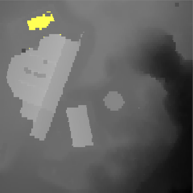

## Project 6: Classifying Lidar data   


*** 
* __Due:__ by Saturday  December 16th, 1pm ( this is the exam day/time for this class in Polaris)
* Group policy: Partner-optional

The goal of this project is to obtain a digital terrain model (DTM) from Lidar data by  converting it to a grid, identifying the "bare ground" ie the points that represent the ground as opposed to noise, buildings and vegetation, removing the non-ground points (noise, buildings and vegetation), and interpolating the resulting "holes" in the ground into a full digital terrain model grid.  While identifying the ground vs non-groud points you will  be able to classify the non-ground objects as buildings or vegetation. 

As usual, check in your code in the github repository and send me a report ---- containing: 
1. images that showcare your results for the three dataset
2. how do you classify ground vs non-ground (and vegetation vs buildings if you do that)
3. a list of all parameters that can be tuned and their values 
4. instructions on how to run your code.   
5. Reflection: How did this project work for you? which of the six projects this semester was your favorite?

Note that if your project is not fully working, your report should include  all the details on your process, what you tried and where you got stuck. 

***


# Dataset ```france.las```

```
./main data/france.txt      
read total 101206 points
	bounding box:  x=[876734.00, 876834.00], y=[2260797.00,2260897.00], z=[348.28,362.93]
lidar_to_dsm:
	n=101206, sqrt(n) =318, corresponding cell_x = 0.3, cell_y=0.314
	starting with: nrows = 319,  ncols =319, cellsize = 0.314
	nb.last returns: 92755 (out of 101206 total points)
	#points/cell     #cells
	         0      37843
	         1      41018
	         2      18167
	         3       4006
	         4        535
	         5         93
	         6         34
	         7         20
	         8         16
	         9          9
	        10          8
	        11          3
	        12          6
	        13          1
	        14          1
	        15          1
	     total      92755
	       avg       0.91 (nb.points/cells)
	       avg       1.45 (nb.points/non-empty cells)
	grid size accepted.
lidar_to_dsm: done
grid dsm (0x600000658000):
	n=101761 [rows=319,cols=319], range=[348.28, 362.93], avg value=352.9 nodata=37843 (37.2%)
writing map.dsm-grayscale.bmp
cc 1: source vertex (1,1)..done. 43250 points reached and marked as 1
	cc_id=  1: size=43250, bbox=[1,237,1,237], bbox_fill=76.999763
cc 2: breakline source vertex (3,217)..done. 24 points reached and marked as 2
	cc_id=  2: size=   24, bbox=[3,7,217,221], bbox_fill=96.000000
cc 3: source vertex (5,219)..done. 1 points reached and marked as 3
	cc_id=  3: size=    1, bbox=[5,5,219,219], bbox_fill=100.000000
cc 4: breakline source vertex (24,14)..done. 1 points reached and marked as 4
	cc_id=  4: size=    1, bbox=[24,24,14,14], bbox_fill=100.000000
cc 5: breakline source vertex (26,10)..done. 3 points reached and marked as 5
	cc_id=  5: size=    3, bbox=[26,27,9,10], bbox_fill=75.000000
[...]skipped
cc size thresholds: T1=40mp(1294.4 cells), T2=1000mp(32360.5 cells), with 1cell=0.03mp
writing map.ground-hillshade.bmp
dilate nodata
dilate nodata
writing map.ground-hillshade.bmp
interpolate_dtm_grid: 
	added 3177 points to the queue
interpolate_dtm_grid done. 
writing map.ground-interpolated.bmp
```


****

# Dataset ```house.las```

```
(base) ltoma@XVR66RXWMT code % ./main data/house.txt 
read total 57084 points
	bounding box:  x=[309227.00, 309269.00], y=[6143455.00,6143497.00], z=[451.40,471.39]
lidar_to_dsm:
	n=57084, sqrt(n) =238, corresponding cell_x = 0.2, cell_y=0.176
	starting with: nrows = 239,  ncols =239, cellsize = 0.176
	nb.last returns: 36605 (out of 57084 total points)
	#points/cell     #cells
	         0      43135
	         1       2312
	         2       2496
	         3       7650
	         4       1363
	         5        107
	         6         43
	         7         14
	         8          1
	     total      36605
	       avg       0.64 (nb.points/cells)
	       avg       2.62 (nb.points/non-empty cells)
	grid size accepted.
lidar_to_dsm: done

grid dsm (0x6000018e4000):
	n=57121 [rows=239,cols=239], range=[451.40, 471.14], avg value=459.1 nodata=43135 (75.5%)
writing map.dsm-grayscale.bmp
lidar_to_bareground:
erode
erode
dilate
writing map.dtm1.hillshade.bmp
generate_slope:
grid slope_grid: (0x6000018e9350):
	n=57121 [rows=239,cols=239], range=[0.00, 1.52], avg value=0.3 nodata=1356 (2.4%)
writing map.slope-on-hillshade.bmp
writing map.ground-hillshade.bmp
dilate nodata
dilate nodata
writing map.ground-hillshade.bmp
interpolate_dtm_grid: 
	added 3177 points to the queue
interpolate_dtm_grid done. 
writing map.ground-interpolated.bmp
```

Pre-classified, as shown by ```lidarview```


Ground only: 


Created by my code: 

Digital surface model, initial and after one erode: 


After one more erode: 



And a dilate: 


The hillshade: 


Slope: 


Breaklines (points in red are points with slope >= 45 deg):


Connected components, each shown with a different color:


Attempt at classification (based on cc size and bbox fill): 


And finally, the interpolated bare gound = digital __terrain__ model: 


***
# Dataset ```fusa.las```

```
(base) ltoma@XVR66RXWMT code % ./main data/fusa.txt      
read total 277573 points
	bounding box:  x=[277750.00, 278000.00], y=[6122250.00,6122500.00], z=[42.21,64.35]
lidar_to_dsm:
	n=277573, sqrt(n) =526, corresponding cell_x = 0.5, cell_y=0.475
	starting with: nrows = 527,  ncols =527, cellsize = 0.475
	nb.last returns: 263370 (out of 277573 total points)
	#points/cell     #cells
	         0      97010
	         1     101976
	         2      75415
	         3       2781
	         4        516
	         5         29
	         6          2
	     total     263370
	       avg       0.95 (nb.points/cells)
	       avg       1.46 (nb.points/non-empty cells)
	grid size accepted.
lidar_to_dsm: done

grid dsm (0x60000315d200):
	n=277729 [rows=527,cols=527], range=[42.21, 64.30], avg value=47.9 nodata=97010 (34.9%)
writing map.dsm-grayscale.bmp
lidar_to_bareground:
erode
erode
dilate
writing map.dtm1.hillshade.bmp
generate_slope:
grid slope_grid: (0x600003154060):
	n=277729 [rows=527,cols=527], range=[0.00, 1.51], avg value=0.2 nodata=2104 (0.8%)
writing map.slope-on-hillshade.bmp
cc 1: source vertex (1,1)..done. 1 points reached and marked as 1
	cc_id=  1: size=    1, bbox=[1,1,1,1], bbox_fill=100.000000
cc 2: breakline source vertex (1,2)..done. 7 points reached and marked as 2
	cc_id=  2: size=    7, bbox=[1,4,1,3], bbox_fill=58.333332
cc 3: source vertex (1,4)..done. 218307 points reached and marked as 3
	cc_id=  3: size=218307, bbox=[1,525,1,525], bbox_fill=79.204353
cc 4: breakline source vertex (1,69)..done. 223 points reached and marked as 4
	cc_id=  4: size=  223, bbox=[1,26,65,112], bbox_fill=17.868591
cc 5: source vertex (1,71)..done. 543 points reached and marked as 5
	cc_id=  5: size=  543, bbox=[1,24,67,110], bbox_fill=51.420456
cc 6: breakline source vertex (1,194)..done. 140 points reached and marked as 6
	cc_id=  6: size=  140, bbox=[1,17,194,233], bbox_fill=20.588236
[...]skipped
writing map.ground-hillshade.bmp
dilate nodata
dilate nodata
writing map.ground-hillshade.bmp
interpolate_dtm_grid: 
	added 11353 points to the queue
interpolate_dtm_grid done. 
writing map.ground-interpolated.bmp
```

Pre-classified, as shown by ```lidarview```


ground only: 


buildings and vegetation:


Created by my code: 

Digital surface model (dsm): 


Eroded:


Eroded again: 


Dilated: 


Hilllshade: 


Slope: 


Breaklines: Points shown in red are points with slope >= 45 deg:


Connected components, each shown with a different color:


Attempt at classification (based on cc size and bbox fill): 


And finally, the interpolated bare gound = digital __terrain__ model: 


